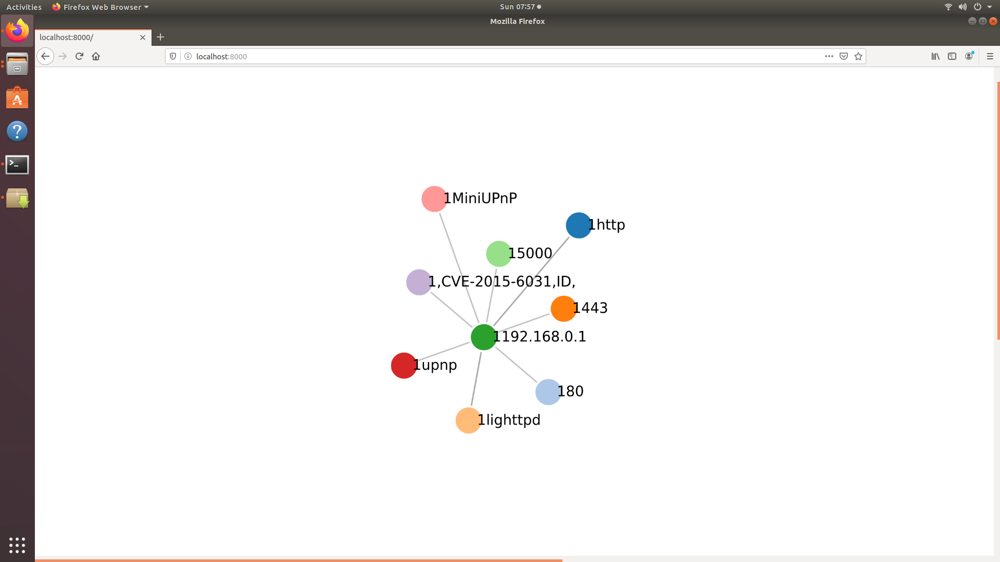
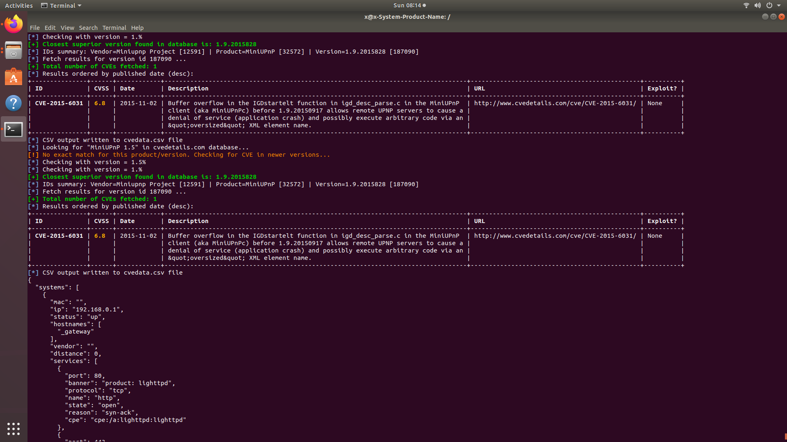
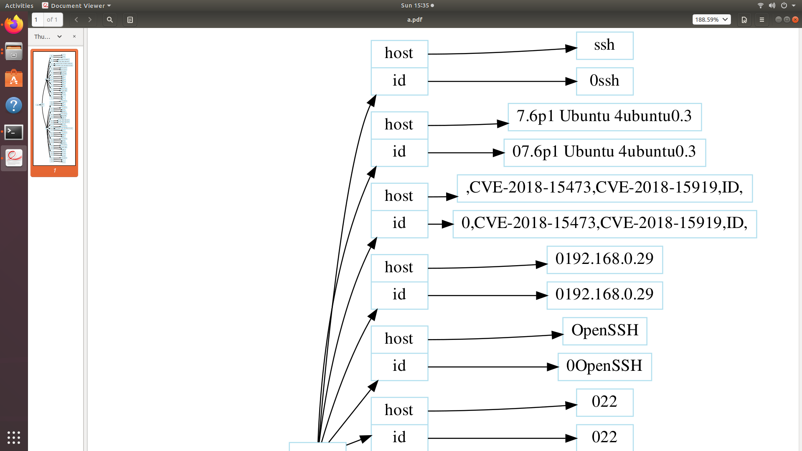

## What olger does

Olger Nmap D3.js data visualizer with CVE check and ansible playbook smart generation.

Local python webserver in localhost for graph visualization with D3.js .

Uses www.cvdetails.com to identify Cyber Security Vulnerabilities .

Sends data to elasticsearch and visualizes data in kibana .

Ansible inventory generation, group inventory per software type

Graphviz export, export pdf and .dot files

Shodan api - Cooming soon

Metasploit integration - Cooming soon


## Why

Because we are tired and do not want to work, we have created olger, for those who have to create infinite inventories in giant infrastructures and have controlled the safety of the machines, from launching a patch to installing and hardening servers or HAP balancers. Make pretty security scans and reports without doing nothing.


## Please don't use for bad things

The information collected with this tool can be illegal in some countries, sometimes can expose big infrastructures to a dangerous consequences if you publish something, take care on that, this tool sends non malicious packets around the network to check connectivity and other cybersecurity issues.


## Install the tools

Execute command:
```bash
cd olger

chmod +x install

./install


```


## How to plot a network graph

Execute command:


```bash
cd olger

chmod +x olger.sh (Just first time)

./olger.sh 192.168.0.1-255 name-mission

```


Outputs:

  - cvedetails.cve , a csv format with vulneravilities in the network
  - web/graphs/data.json, a compatible D3.js json graph data format
  - reports/reportNameMission.txt, a plaint text data report in txt format
  - web server in port 8000, serving D3.js interactive graph
  - elasticsearch with tls support push
  
## How to dump a workless security report

Execute command:


```bash

cd olger

chmod +x genreport.sh (Just first time)

./genreport.sh ./web/graphs/data.json name-mission


```

Outputs:

  -reports/nameMission/namemission.pdf
  -reports/nameMission/namemission.dot

## How it looks

Explore the network with browser view and D3.js Graph




Make a plain text report with cvdetails connection




Export pretty report to PDF and DOT files.




Send data to elastic search and import our Dashboard in KIBANA


