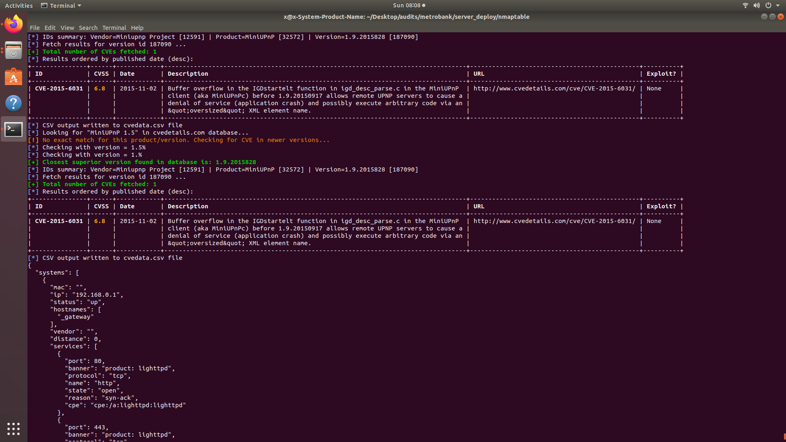

## What olger does

Olger make a network scan parse the data ans send to elastic search, make a scan report in txt, open python webserver in localhost for visualization in D3.
Uses cvdetails.com to identiy Cyber Security Vulnerabilities
Cooming soon complete report in pdf and network diagram in pdf with vulnerability checks

## How

Runnig this is as easy as:

#### Nmap Your Target:
`
 ./olger.sh 192.168.0.1-255 name-mission

