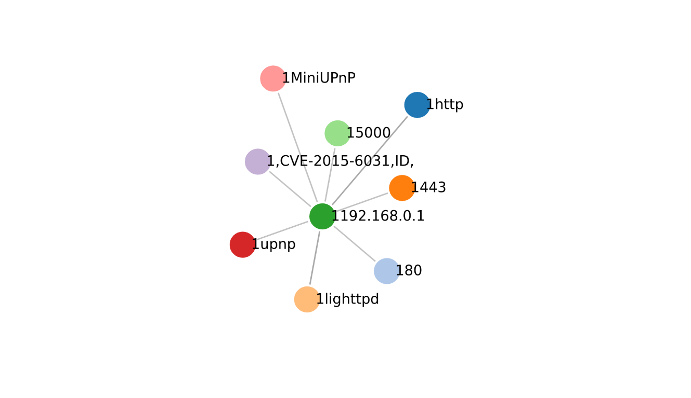
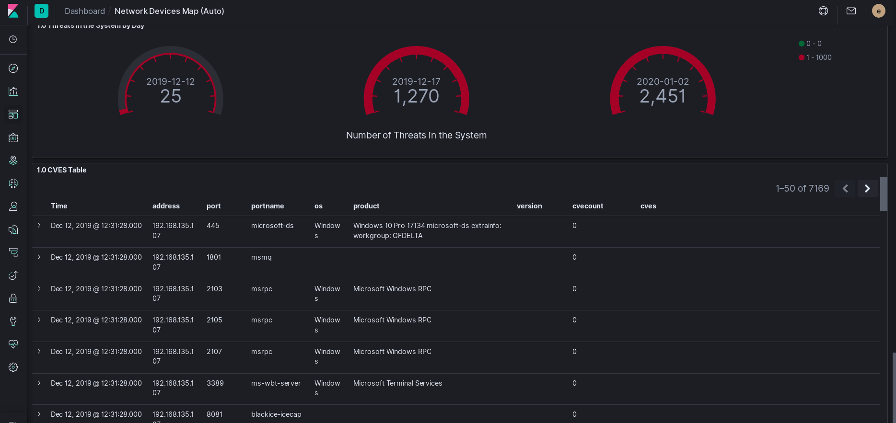
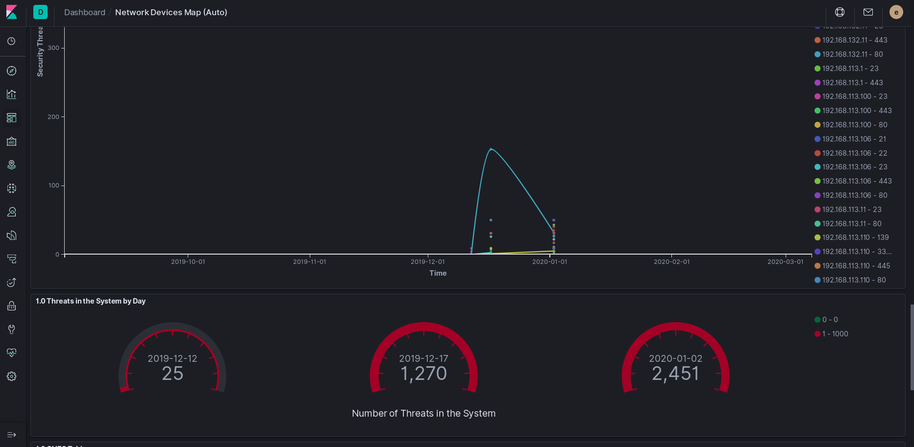
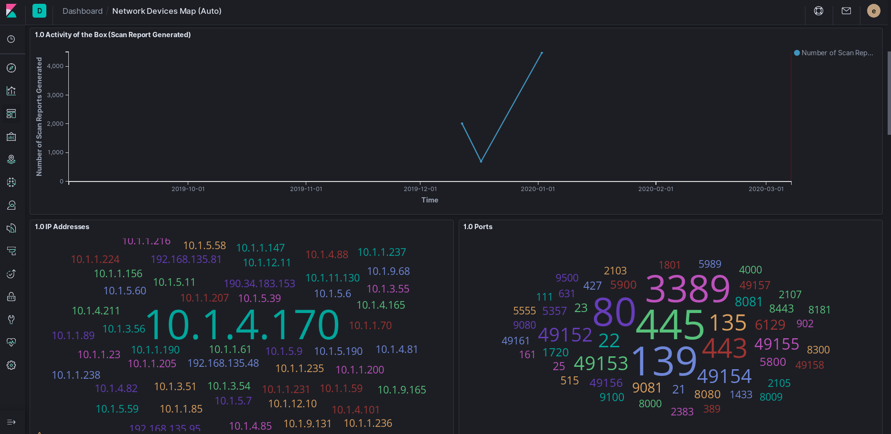

## What olger does

Olger Nmap D3.js data visualizer with CVE check and ansible inventories smart generation.

Local python webserver in localhost for graph visualization with D3.js .

Uses www.cvdetails.com to identify Cyber Security Vulnerabilities .

Sends data to elasticsearch and visualizes data in kibana .

Ansible inventory generation, group inventory per software type

Graphviz export, export pdf and .dot files

Shodan api

Generates HA proxy configs for big networks

Metasploit integration


## Why

Because we are tired and we not want to work, we have created olger, for those who have to create infinite inventories in giant infrastructures and have controlled the safety of the machines, from launching a patch to installing and hardening servers or HAP balancers. Make pretty security scans and reports without doing nothing.

In the most of the big infrastructures they have a lot of internal services to manage his infrastructures, for do that , normally no body thinks in the security and is a super bridge, you can ping to your bureaucratized , scan them, a lot of trafic arent encrypted, a lot s passwords in plain ...

The timing to repair or modify things is extremlly bureaucratized, and normally is by hand going to the machines and making the changes, we want to work less , this is the reason for olger, keep your organization controlled in security terms, repair fast and in a easy way, and keep your network isolated. 


## Please don't use for bad things

The information collected with this tool can be illegal in some countries, sometimes can expose big infrastructures to a dangerous consequences if you publish something, take care on that, this tool sends non malicious packets around the network to check connectivity and other cybersecurity issues.


## Install the tools

Execute command:

```bash
cd olger

chmod +x ./install

./install


```

## Usage


```bash
Usage: $PROGNAME [OPTION ...] [foo] [bar]
Olger a Red Team tool with ansible playbooks to repair things , D3.js Graph visualization, metasploit and shodan
Options:

-h, --help          display this usage message and exit

-n, --genfromnmap  [RANGE] [MISSION]     delete things

-f, --genfromfile [FILE] generate a graph from nmap xml file

-s, --genfromshodan [QUERY] write output to file

-m, --msfconsole [EXPLOIT_CHECK] [PAYLOAD] [CMD] [LIST] execute msf command for each input in the list

-r, --report [MISSION] write output to file in pdf and dot format

-p, --hapgen [DATAFILE] Generate haproxy configuration

-q, --query [DIR] [QUERY] make querys over raw json or csv data (not ready)

```

## How to plot a network graph with nmap

Execute command:


```bash
cd olger

chmod +x olger (first time only)

./olger -n 192.168.0.1-255 name-mission

```


Outputs:

  - cvedetails.cve , a csv format with vulneravilities in the network
  - web/graphs/data.json, a compatible D3.js json graph data format
  - reports/reportNameMission.txt, a plaint text data report in txt format
  - web server in port 8000, serving D3.js interactive graph
  - elasticsearch with tls support push
 
 
 
 
## How to dump a workless security report

Execute command:


```bash

cd olger

chmod +x olger (Just first time)

./olger -r ./web/graphs/data.json name-mission


```

Outputs:

  -reports/nameMission/namemission.pdf
  
  -reports/nameMission/namemission.dot
  
  
## Configure elastic search to visualize data in kibana

Edit scripts(olger_lib.py

Change the auth parameters in the file, elastic and authkey and the url of your elastic service, for example https://yourdomain.com:9200 , remember use tls encryption in your server to prevent expose data in the network.

```

def elkpush(indexdat,jsondat):

        es = Elasticsearch(
                ['host.domain'],
                scheme="https",
                verify_certs=False,
                http_auth=('elastic', 'auth-key'),
		port=9200
	)
	print(es.index(index=indexdat,doc_type="security_report", body=json.dumps(jsondat)))


```

Uncomment line 225 (remove #)

````
 #print(elkpush("box_"+sys.argv[2],toelastic))
 
````

Import dashboard file network_devices.ndjson in your kibana.


    Go to Kibana
    Click on Management
    Click on Saved Objects
    Click on the Import button
    Browse the exported file
    You will then be prompted: "If any of the objects already exist, do you want to automatically overwrite them?" and you will be given the following options:
        No, prompt me for each one
        Yes, overwrite all


## Generate HAPROXY configuration

The motivation to do this after scan a network is make simple the network hardening any where, cut all connections between devices and redirect all trafic to de haproxy, this keeps the network splited and prevents comunications between devices, redirecting all network services in a central point, balanced to higth disponibility . Solve a lot of problems, and encrypt all the network with the minium deployment in the infrastructure, works in parallel while people is testing and one time is ready with a simple ip table rules , the entire network is isolated


```

olger -p data/internal_services.csv

```

Output

  -data/haproxy.conf
  

csv lie format

iphaproxy,domainname,http,ipbackend,portbackend,urlredirect


## How it looks

Explore the network with browser view and D3.js Graph




Make a plain text report with cvdetails connection


Export pretty report to PDF and DOT files.


Send data to elastic search and import our Dashboard in KIBANA




